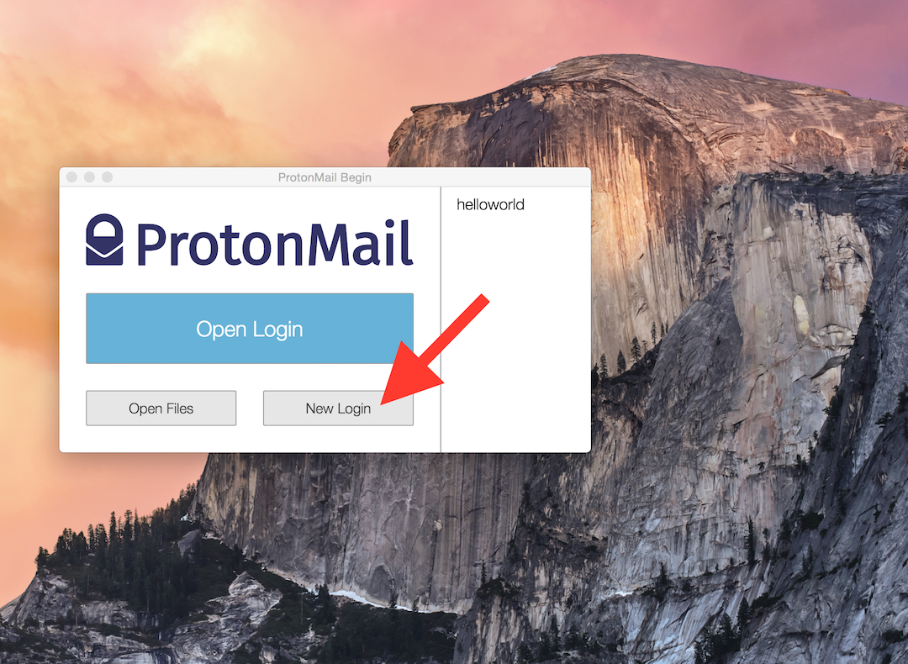
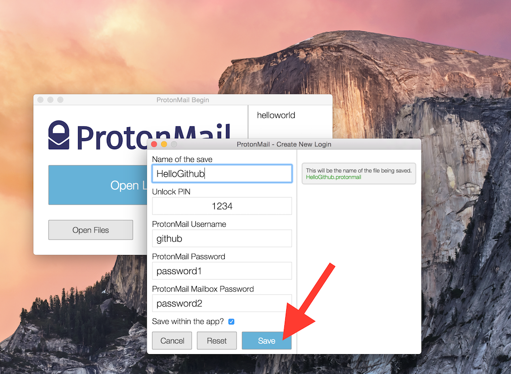
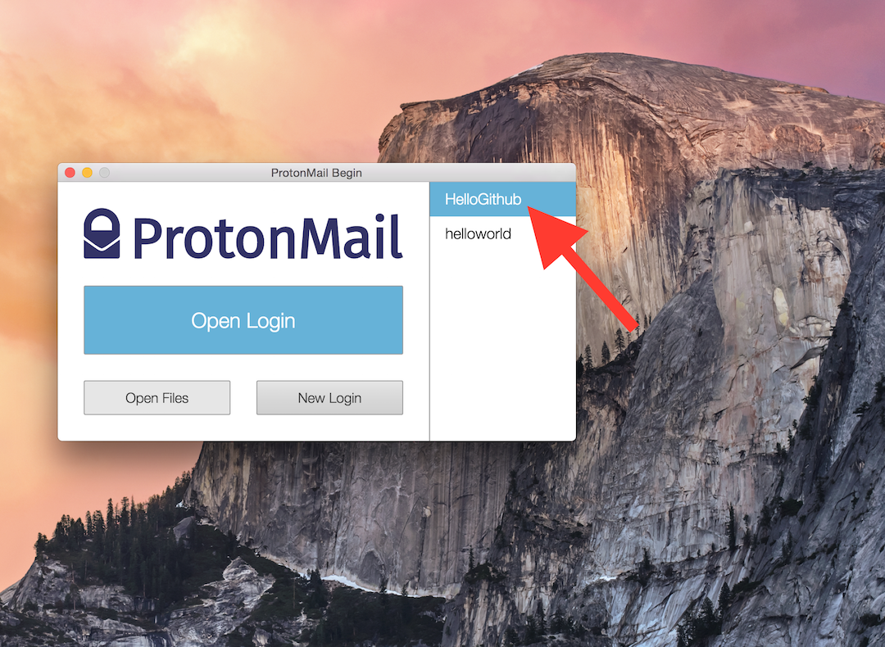
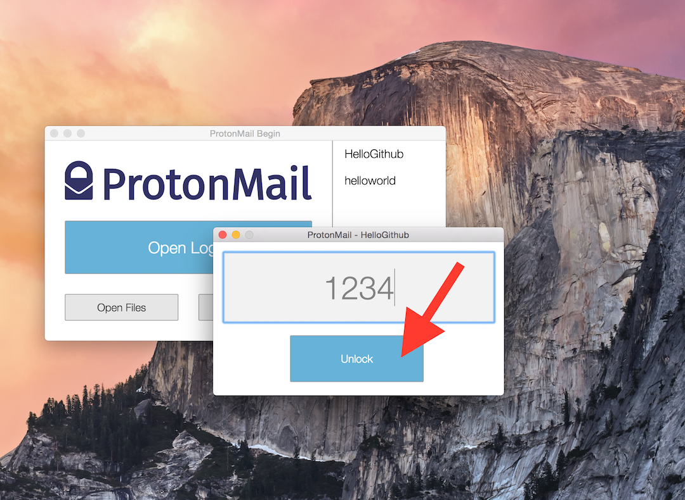
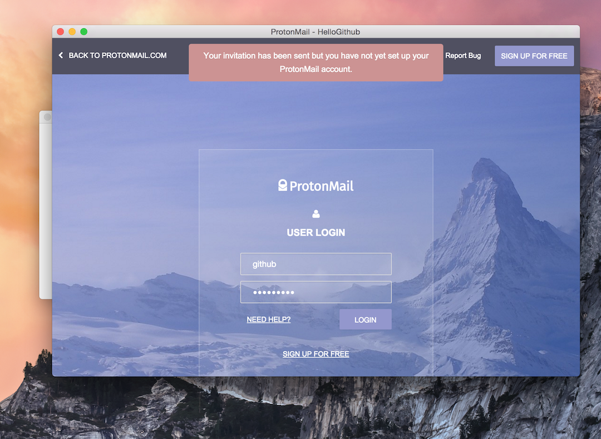

ProtonMail Client
=================

This is an unofficial desktop client that automatically logs you into ProtonMail.

## What is ProtonMail

ProtonMail is an encrypted email service.

## Getting Started
- [Installation](#installation)
- [Usage](#usage)
- [Todo](#todo)
- [License](#license)

## Installation

0. In order to run this application, you need [nodejs](https://nodejs.org/en/) installed.
1. Download this application into a directory, any directory.
2. “cd” into the directory containing the application.
3. Run “npm install”, this will install all the dependencies.
4. Run “npm start”, this will run the application.

## Usage

When you first open the app, a window will appear that looks similar to the introductory window Xcode shows when opened.

Starting off, press “New Login” which will open another window and allow you to enter your credentials.

Now you can begin to create a new login file. First, you need to pick a name in order to differentiate it from other login files. 

Filename conventions are complicated to say the least, so you will be limited to entering alphanumeric characters, but you can rename it after the fact to include other characters if your system supports it.

PINs are also limited to alphanumeric characters, as we do not want any chance of your PIN deforming during the encrypt/decrypt process, or when it is hashed.

Your ProtonMail username and passwords do not receive any checks. Instead, they are immediately converted via base64 and encrypted, as ProtonMail has their own character restrictions and we do not handle your data, we simply pass it along.

You can also decide where to save this file. You can save it in-app, which means that it will be saved within the application cache folder designated by your operating system. Or you can save it wherever you choose, however logins not saved within the app do not appear on the quick access column on the main window.

As you can see, because we saved it within the app, its name appears within the quick access column.

Clicking it will spawn another window. You will be prompted to enter your PIN that you set during the creation process.

Once you have correctly entered your PIN, the window will morph into a large window and allow you to maximise and fullscreen the window. The application will load ProtonMail and automatically enter the credentials you saved and log you in.

## Todo

* Squash bugs.
* Better error conveyance.
* Matching colour scheme.
* Delete and edit functionality.
* Notifications

## License
GNU GPL
